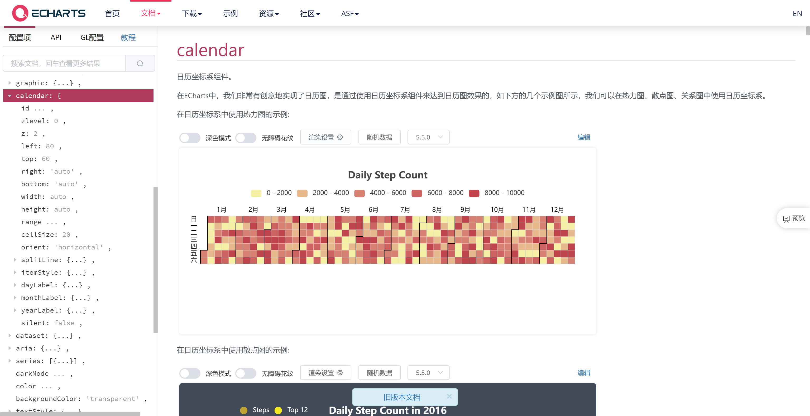
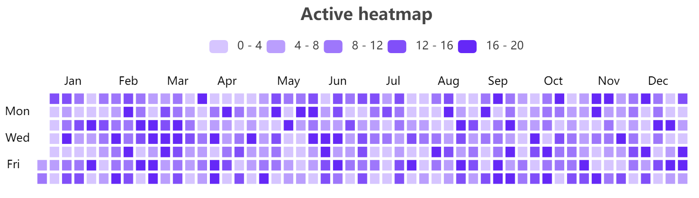

Wordpress中添加类似Github的日历热力图

自己很喜欢Github个人页的日历热力图，觉得好看又实用，能直接显示自己的既往发文情况。因此，抱着这个想法在网上查阅到已经有博主实现了类似的功能。

https://blog.lyc.sh/wp-post-heatmap/#comment-2571

博主“雪糕”直接发布了一个wp版本的插件，直接输入简码就能插入日历图，效果如下：

**参考：**

https://echarts.apache.org/zh/option.html#calendar

https://blog.douchi.space/hugo-blog-heatmap/#gsc.tab=0

https://blog.lyc.sh/wp-post-heatmap/#comment-2571

https://www.wangdu.site/course/2027.html