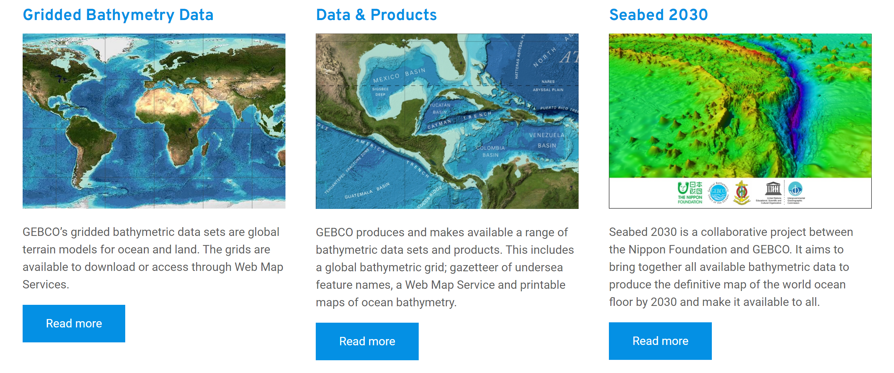
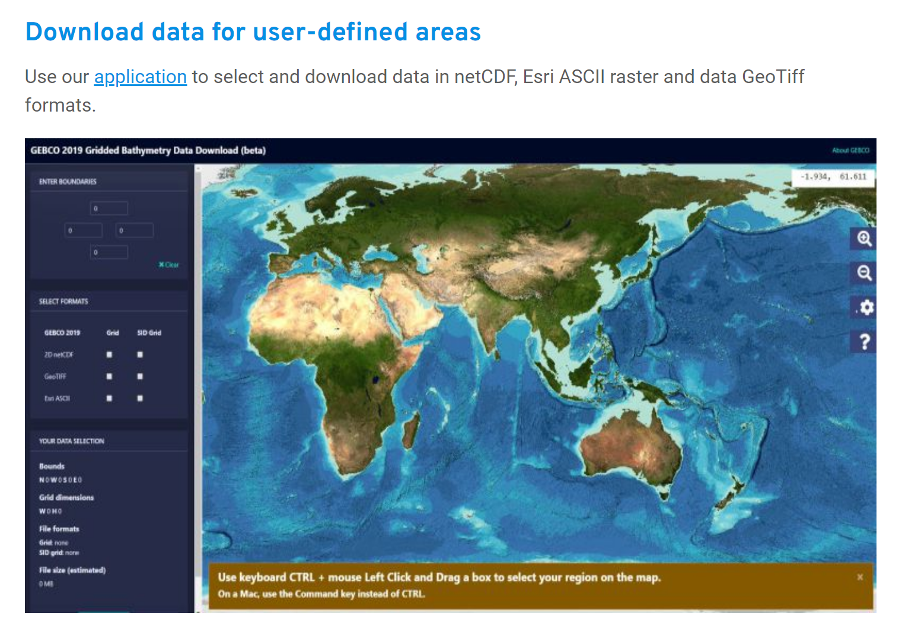

DEM数据下载方式

日本财团GEBCO海底2030项目开发提供了免费的DEM数据下载渠道，进入官方网址即可下载。链接为：https://www.gebco.net/。进入后界面如下。

选择上图中第一个数据，跳转后点击文中"Download data for user-defined areas"会跳到对应部分，见下图。

点击"application"进入区域选择界面，可以在界面左侧输入想获取区域的经纬度，会生成一个矩形下载框。选择数据格式"FORMATS"后，点击下方添加到购物篮中，输入邮箱地址等待发送邮件即可。

**参考：**

https://blog.csdn.net/GISWorld3D/article/details/118549434

